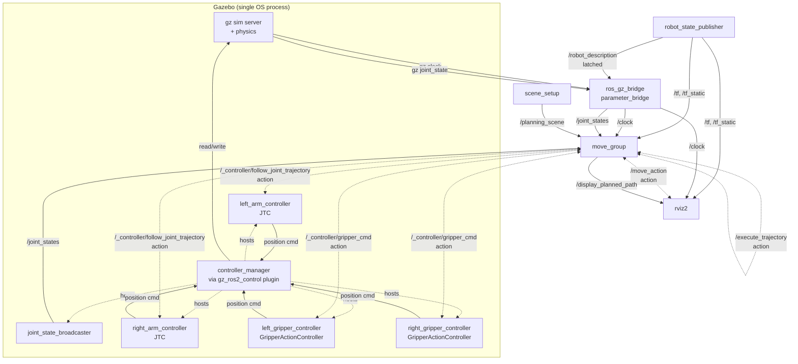
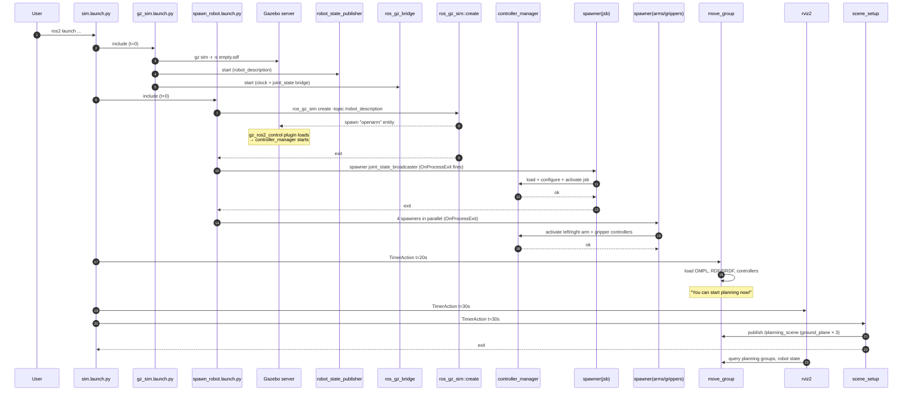

# 03. ROS 2 ノード構成と責務

`ros2 launch openarm_bringup sim.launch.py` を打った直後にプロセス空間に何が現れるか、それらが何を出力して何を入力するかをまとめます。

## ノード一覧

| ノード名 | 実行ファイル | 起動元 | 役割 |
|---|---|---|---|
| `gazebo` / `gz sim server` | `ros_gz_sim::gz_sim` | `gz_sim.launch.py` | 物理シミュレーションと内部の `gz_ros2_control` プラグインのホスト。**この中で `controller_manager` ノードが立つ** |
| `robot_state_publisher` | `robot_state_publisher` | `gz_sim.launch.py` | URDF から TF を計算して `/tf`, `/tf_static` を publish。`/robot_description` も publish（latched） |
| `parameter_bridge` | `ros_gz_bridge` | `gz_sim.launch.py` | Gazebo ↔ ROS 2 のメッセージブリッジ。`/clock` と Gazebo 内部の joint state トピックを `/joint_states` にブリッジ |
| `ros_gz_sim_create` | `ros_gz_sim::create` | `spawn_robot.launch.py` | `/robot_description` を読んで Gazebo にエンティティをスポーンする一発屋。スポーン後は exit |
| `spawner_*` | `controller_manager::spawner` × 5 | `spawn_robot.launch.py` | 各コントローラを `controller_manager` 経由で `configure` → `activate` させる一発屋。activate 後は exit |
| `controller_manager` | `gz_ros2_control` プラグイン内蔵 | Gazebo のプラグインとして起動 | ros2_control の中核。`update_rate: 100Hz` で `read → update → write` ループ |
| `joint_state_broadcaster` | controller として動く | `spawner` 経由 | ros2_control の state interface を読んで `/joint_states` を publish。ros_gz_bridge 経由のものとは別ソース |
| `left_arm_controller`, `right_arm_controller` | controller (JointTrajectoryController) | `spawner` 経由 | `/<name>/follow_joint_trajectory` action サーバを提供。受け取った軌道を補間し、`position` command interface に書き込む |
| `left_gripper_controller`, `right_gripper_controller` | controller (GripperActionController) | `spawner` 経由 | `/<name>/gripper_cmd` action サーバを提供。指定位置に `finger_joint1` を駆動 |
| `move_group` | `moveit_ros_move_group::move_group` | `sim.launch.py`（20s 後） | **MoveIt の頭脳**。planning, IK, collision check, trajectory execution の司令塔。多数の topic/service/action を提供 |
| `rviz2` | `rviz2` | `sim.launch.py`（30s 後） | 可視化と MotionPlanning パネル。`move_group_interface` 経由で `move_group` に Plan & Execute を依頼 |
| `scene_setup` | 自作 Python ノード | `sim.launch.py`（30s 後） | グラウンドプレーンの `CollisionObject` を `/planning_scene` に publish して exit |

## ノード関係図

破線は action / 一発屋系、実線は topic 系を意味します。

## 起動シーケンス（時間軸）

## 各ノードの責務を一言で

- **`gazebo` (gz sim server)**: 物理を回す。それ以外しない。
- **`gz_ros2_control` プラグイン** (Gazebo 内): `controller_manager` を Gazebo のクロックと同期させて動かす。`SystemInterface::read()` で Gazebo の関節状態を取り、`write()` で Gazebo の関節に command を入れる。
- **`robot_state_publisher`**: URDF + `/joint_states` → `/tf`。何も判断しない。
- **`ros_gz_bridge`**: 双方向 message 変換。型と topic 名の対応を引数で 1 対 1 に並べる。
- **`joint_state_broadcaster`**: 全 state interface を `sensor_msgs/JointState` にまとめて `/joint_states` に流す。controller の一種（プログラムとしては controller plugin）。
- **`JointTrajectoryController`** (`*_arm_controller`): `FollowJointTrajectory` action を受けて、軌道点の間を内部で補間しながら command を書き続ける。
- **`GripperActionController`** (`*_gripper_controller`): `GripperCommand` action を受けて、目標位置をそのまま command に流し、stall 検知（速度 `< 0.001 m/s` が 1s 続いたら成功とみなす）まで保持する。
- **`move_group`**: 「ある planning group をある goal に持っていきたい」を入力に、planner で trajectory を作り、controller に投げて完走を見届け、結果を action result で返す。
- **`rviz2`**: ユーザが触る UI。`move_group_interface` 経由で `move_group` を叩く。
- **`scene_setup`**: 「床は壁」と MoveIt に教える 1 回限りの publisher。

## 「これって誰がやってる？」 FAQ

| 質問 | 答え |
|---|---|
| `/joint_states` を出してるのは誰？ | `joint_state_broadcaster`（controller の一種）と `ros_gz_bridge`（Gazebo 経由）の **両方**。普通は jsb の方を使う |
| URDF はどう Gazebo に渡る？ | `robot_state_publisher` が `/robot_description` を latched で publish、`ros_gz_sim::create` が `-topic /robot_description` でそれを読んで Gazebo にスポーン |
| controller_manager はどこに居る？ | Gazebo プロセスの中。`<plugin filename="gz_ros2_control-system">` で起動。`ros2 node list` には専用のノードとして見えないが、`/controller_manager/*` service が立つ |
| IK は誰が計算してる？ | `move_group` 内部の `kdl_kinematics_plugin/KDLKinematicsPlugin`。RViz でインタラクティブマーカーを引きずると Cartesian path service が呼ばれる |
| Plan ボタンと Plan & Execute ボタンの違いは？ | Plan は `/move_action` を `plan_only=true` で叩いて軌道を返してもらうだけ。`Execute` はその後 `/execute_trajectory` action を叩く。`Plan & Execute` は `plan_only=false` で一回で両方をやる |
| Gazebo が pause だと何が止まる？ | `/clock` が進まなくなり、`use_sim_time: true` のノード全部の時計が止まる。`joint_state_broadcaster` も publish が止まる |
