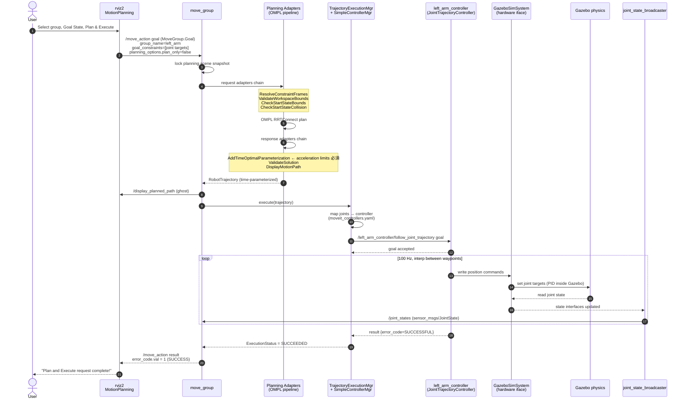
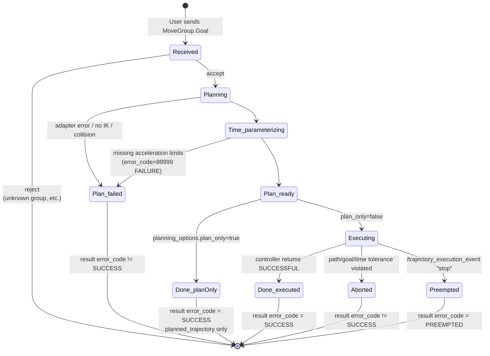
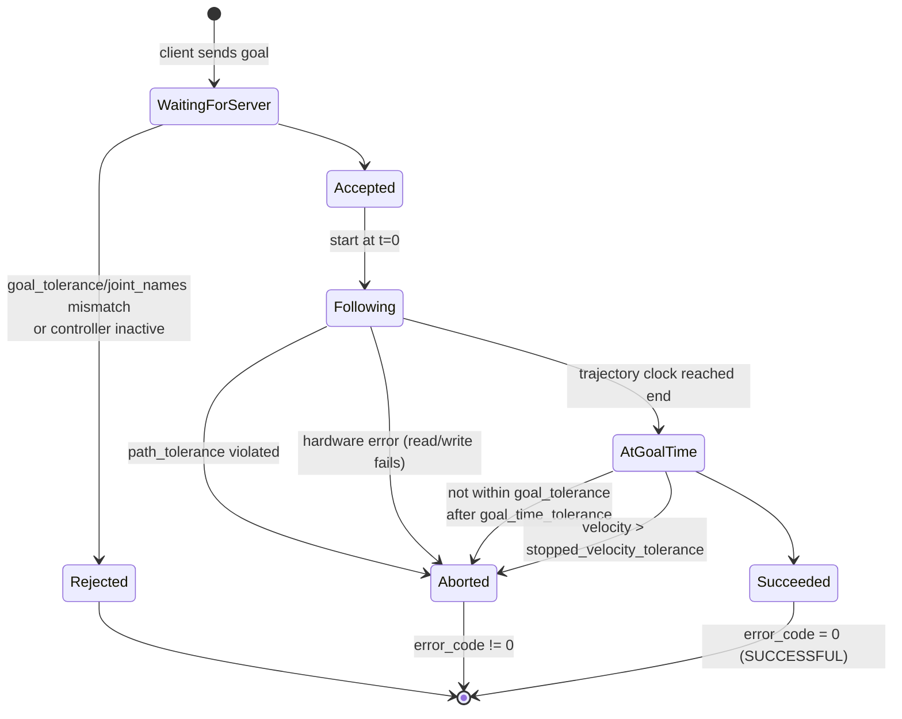
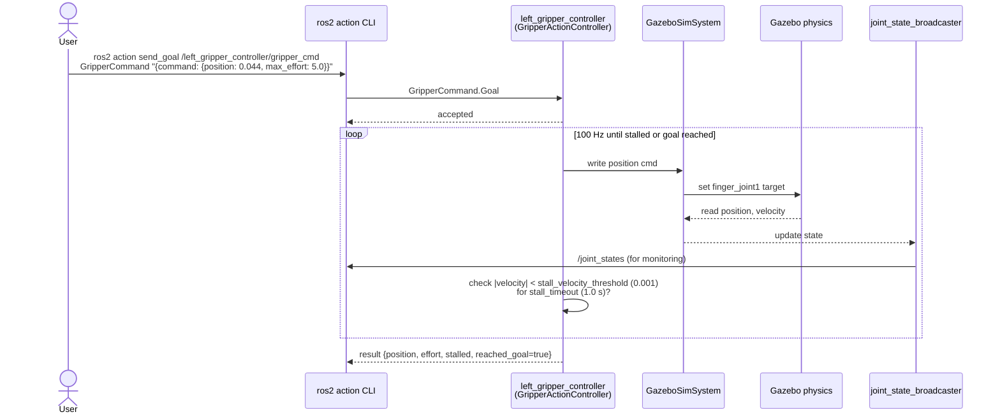

# 05. MotionPlanning の動作シーケンス

ユーザが RViz の MotionPlanning パネルで `Plan & Execute` を押した瞬間から、Gazebo の関節が動き終わるまでに何が起きるかを追います。CLI から `/move_action` を直接叩く場合も内部は同じ経路です。

## ハイレベル: 4 つのレイヤ

```
┌────────────────────────────────────────────┐
│ UI レイヤ:    RViz MotionPlanning panel     │
├────────────────────────────────────────────┤
│ 知能レイヤ:   move_group                    │
│              ├─ Planning pipeline (OMPL)    │
│              ├─ Request/Response adapters   │
│              └─ Trajectory execution manager│
├────────────────────────────────────────────┤
│ 制御レイヤ:   controller_manager (in Gazebo)│
│              ├─ JointTrajectoryController   │
│              └─ GazeboSimSystem (HW iface)  │
├────────────────────────────────────────────┤
│ 物理レイヤ:   gz sim (DART physics)         │
└────────────────────────────────────────────┘
```

上から下へ「指示」が流れ、下から上へ「観測（`/joint_states`, TF）」が戻ります。

## シーケンス図: Plan & Execute（joint-space goal）



### ポイント

- **`AddTimeOptimalParameterization`** が response adapter の最初に居る。ここで全関節の `max_velocity` と `max_acceleration` を見て時間軸を貼る。**acceleration が無い／0 だと adapter は FAILURE を返し、これ以降の adapter には進まない**。これが当初のバグの本質（[01-design.md §7](01-design.md#7-すべての関節に-acceleration-limit-を入れる)）。
- **`/joint_states` は実行中も流れ続ける**。`move_group` の trajectory execution manager は遅延と path tolerance を監視しており、`stopped_velocity_tolerance` や `goal_tolerance` を逸脱すると ABORTED を返す。
- **MoveIt → controller の対応付け**は [`moveit_controllers.yaml`](../ros_ws/src/openarm_bimanual_moveit_config/config/moveit_controllers.yaml) で固定。`action_ns: follow_joint_trajectory` と `joints: [...]` で `/<controller_name>/<action_ns>` を組み立て、planning group の全関節がカバーされる controller を選ぶ。

## 状態遷移図: `/move_action` ゴールの寿命



## 状態遷移図: `FollowJointTrajectory` ゴールの寿命

JTC 側で何が起きるか。`/move_action` の中段 (Executing) はこれです。



## シーケンス図: グリッパ単独で動かす（CLI）

JTC 経路を介さずに直接 controller を叩くパターン。MoveIt は関与しない。



## 失敗パターンと切り分け

### A. Plan & Execute → SUCCESS と出るが Gazebo が動かない（過去のバグ）

- **原因**: `joint_limits.yaml` の acceleration が無い、または `robot_description_planning` namespace に乗っていない
- **症状**: move_group ログに `No acceleration limit was defined for joint ...` → `AddTimeOptimalParameterization failed` → `error_code: 99999 (FAILURE)`
- **対策**: [01-design.md §6, §7](01-design.md) 参照。本リポジトリでは修正済み。

### B. Plan できるが Execute で goal_time_tolerance 超過 ABORT

- **原因**: 速度スケールが大きすぎて Gazebo の PID が追従しきれない
- **症状**: `[*_arm_controller] Aborted due to goal_time_tolerance exceeding by N seconds`
- **対策**: RViz の `Velocity Scaling` を 0.1〜0.3 に下げる、または `joint_limits.yaml` の `max_acceleration` を上げる

### C. Plan で start state in collision

- **原因**: 初期姿勢が ACM 未許可ペアで衝突判定されている
- **対策**: SRDF の `<disable_collisions>` を追加、または初期姿勢を安全側に変更

### D. Plan で no solution found

- **原因**: goal が IK 解なし、ワークスペース外、collision
- **対策**: `num_planning_attempts` を増やす、`allowed_planning_time` を伸ばす、goal を見直す

### E. RViz が Cartesian path 後に SEGV

- **原因**: `current_state_monitor` が `/joint_states` の stamp と sim clock のズレでタイムアウトし、moveit_ros_visualization のロジックが null を踏む（既知の不安定さ）
- **症状**: `Didn't receive robot state (joint angles) with recent timestamp within 1.0s` → SIGSEGV (`exit code -11`)
- **トリガ**: RViz でインタラクティブマーカーを引きずる（`/compute_cartesian_path` を呼ぶ）
- **対策**: Gazebo を pause せず常に Play、joint-space の Goal State ドロップダウンを使う、ヘビーな操作は CLI 経由に逃がす

## CLI で同じことを再現する最小サンプル

ある planning group をある goal に持っていく：

```bash
ros2 action send_goal /move_action moveit_msgs/action/MoveGroup '{
  request: {
    group_name: "left_arm",
    num_planning_attempts: 5,
    allowed_planning_time: 5.0,
    max_velocity_scaling_factor: 0.3,
    max_acceleration_scaling_factor: 0.3,
    goal_constraints: [{
      joint_constraints: [
        {joint_name: openarm_left_joint1, position: 0.5,
         tolerance_above: 0.05, tolerance_below: 0.05, weight: 1.0},
        {joint_name: openarm_left_joint4, position: 1.0,
         tolerance_above: 0.05, tolerance_below: 0.05, weight: 1.0}
      ]
    }]
  },
  planning_options: { plan_only: false }
}'
```

結果の `error_code.val: 1` が SUCCESS。

MoveIt をスキップして JTC を直接叩く（早い／確実）:

```bash
ros2 action send_goal /left_arm_controller/follow_joint_trajectory \
  control_msgs/action/FollowJointTrajectory \
  "{trajectory: {joint_names: [openarm_left_joint1, openarm_left_joint2, openarm_left_joint3, openarm_left_joint4, openarm_left_joint5, openarm_left_joint6, openarm_left_joint7], points: [{positions: [0.5, 0.3, 0.0, 1.0, 0.0, 0.0, 0.0], time_from_start: {sec: 5}}]}}"
```

[04-interfaces.md](04-interfaces.md) のメッセージ早見表と並べて読むのがおすすめ。
